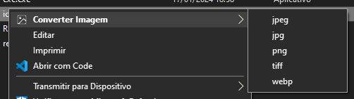

# convert-image

Script para criar menu no Windows com opções para converter imagens.

**:warning: NECESSÁRIO TER FFMPEG NA MÁQUINA :warning:**

> Preview:

## Como usar

Adicionar esta pasta no diretório desejado e executar `add-to-registry.bat` como administrador. Com isso o executável `exe.exe` será adicionado nos registros e pronto para usar.

### Remover

Execute `remove-from-registry.bat` como administrador.

# Código fonte

Código escrito em Rust, projeto dentro da pasta `convert-image`. Tem como função apenas validar argumentos e iniciar o processo do ffmpeg.